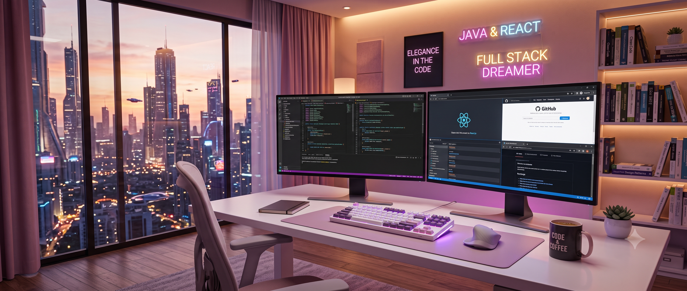



---

### 👩‍💻 Who am I?

- 🌸 **Full Stack Developer** passionate about crafting beautiful digital experiences
- 🎓 Skilled in **React, JavaScript, MySQL, MongoDB, Java, Spring Boot, Bootstrap, HTML5** and **CSS3**
- 🌱 Currently growing my skills through **Spring Boot** and **React** to enhance my expertise
- 🔗 Check out my Portfolio: **[My Portfolio](#)**
- 💌 You can reach me at: **bhumikajain54@gmail.com**
- 🤝 Connect with me on **[LinkedIn](#)**

---

### 🌸 About Me

Skilled in front-end and back-end technologies including **HTML, CSS, React.js, JavaScript, Java, Spring Boot, MySQL**, and **Bootstrap**. Passionate about exploring and integrating technologies and methodologies, and enhancing my coding skills through continuous learning. Seeking an **entry-level software engineer** role in a technology-driven firm to apply and grow my skills in **full stack development**.

---

### 🛠 Skills & Tools

  
  
  
  
  
  
  
  
  
  
  
  
  
  

 

---

### 📊 GitHub Stats

---

### 📌 Pinned & Popular Repositories

<table width="100%">
  <tr>
    <td width="50%" valign="top">
      <h4>🧩 Employee Management System</h4>
      
Full-stack app to manage employees, departments, attendance &amp; leaves.

      
      
      
    </td>
    <td width="50%" valign="top">
      <h4>🧩 Sanitaryware Shop</h4>
      
Full-stack e-commerce platform with cart &amp; checkout.

      
      
      
    </td>
  </tr>
  <tr>
    <td width="50%" valign="top">
      <h4>🧩 JobSahi Admin Dashboard</h4>
      
Admin dashboard for job portal with candidate tracking.

      
      
      
    </td>
    <td width="50%" valign="top">
      <h4>🧩 Sales Force Automation</h4>
      
Sales pipeline automation with analytics &amp; reporting.

      
      
    </td>
  </tr>
  <tr>
    <td width="50%" valign="top">
      <h4>🧩 Developer Portfolio</h4>
      
Personal portfolio built with React &amp; Tailwind CSS.

      
      
    </td>
    <td width="50%" valign="top">
      <h4>🧩 MRJ Architects</h4>
      
Architect firm website with project showcase.

      
      
    </td>
  </tr>
</table>

---

### 🤝 Let's Connect

---

### 👥 GitHub Community

---

